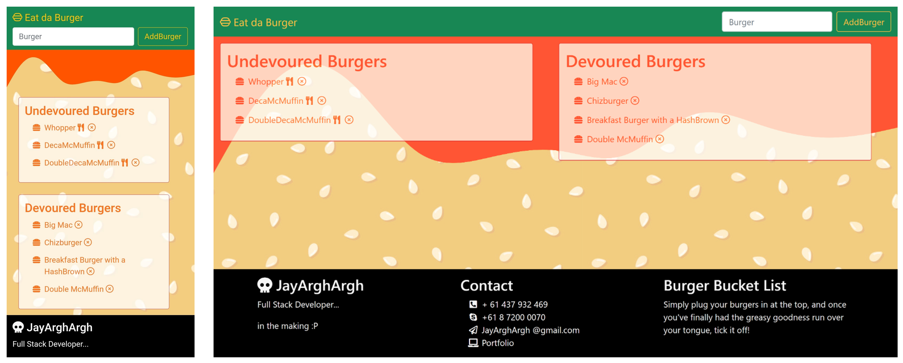

# Eat Da Burger!
## Table of Contents
> - [Description](#Description)
> - [Table of Contents](#Table-of-Contents)
> - [Installation](#Installation)
> - [Usage](#Usage)
> - [License](#License)
> - [Contributing](#Contributing)
> - [Tests](#Tests)
> - [Questions](#Questions)

## Description
Mobile first, HTML5, Bootstrap, MySQL, React, HandleBars app deployed to Heroku.

* [View the deployed app on Heroku](https://polar-castle-27980.herokuapp.com/)
* [View it on GitHub](https://github.com/JayArghArgh/eat-da-burger)
* [View my updated portfolio](http://jayarghargh.com)

## Installation
N/A
## Usage
Visit the webapp and add a burger, or devour one
## License
This application is covered under None.
## Contributing
Please report any bugs :)
## Tests
No tests required.
## Questions
Please refer any questions to  via jayarghargh@gmail.com.

>  This README.md created with .

